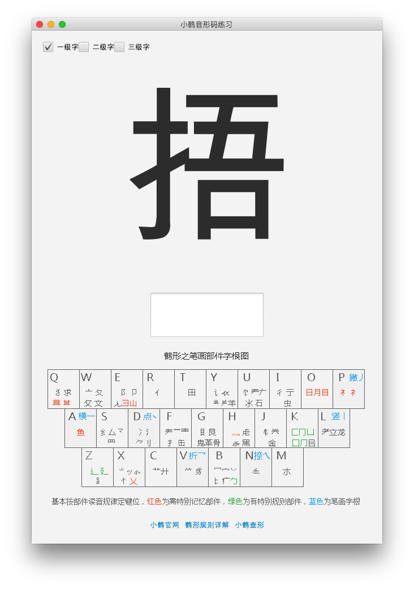

小鹤音形练习
======

用于小鹤音形码的练习工具。



使用JavaFx实现，可以运行于多个操作系统。

安装
----

检查本地Java版本，需要1.8及以上：

```
java -version
```

下载并自动运行：

```
git clone https://github.com/freewind/xiaohe-yinxing-practice
cd xiaohe-yinxing-practice
./gradlew run
```

